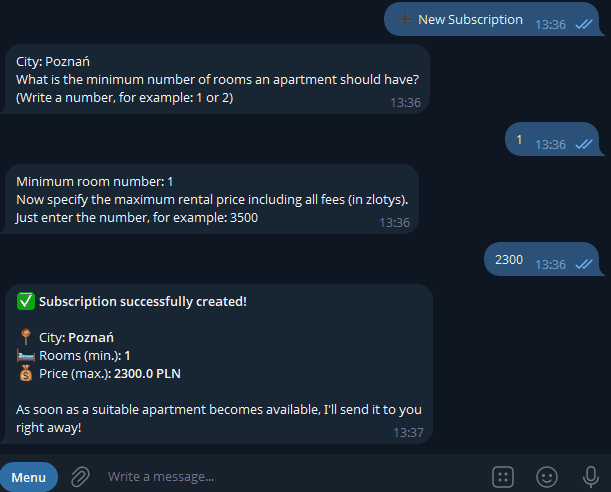

# PolandRent Analytics

An automated system that scrapes apartment rental listings across major Polish
cities, stores them in PostgreSQL, and matches new listings against
user-defined criteria (city, price, room count, area, pets) in real time.
Matched users get notified instantly through a Telegram bot; there's also a
daily digest of the cheapest listings per m².

[](https://github.com/zyxweqx/polandrent-analytics/actions/workflows/ci.yml)




## Features

* Asynchronous web scraping of OLX/Otodom (Playwright, headless Chromium) across 5 cities in parallel.
* A FastAPI REST API for apartments, subscriptions, and users, backed by PostgreSQL via async SQLAlchemy 2.0 and Alembic migrations, secured with a shared API-key header.
* A Telegram bot (aiogram 3) for registering and managing subscriptions through an FSM-driven conversation.
* Real-time matching: every newly scraped apartment is checked against all active subscriptions; matching and Telegram notifications run as a FastAPI background task so the scraper's request isn't blocked on message delivery.
* Automatic retries with exponential backoff (tenacity) on the scraper's API calls and on Telegram delivery, so a single transient network failure doesn't silently drop a listing or a notification.
* A daily analytics digest (pandas) with average price per district and the top 5 cheapest listings per m².
* A typer-based CLI (`app/cli.py`) for running the scraper and the analytics digest by hand.
* Fully containerized with Docker Compose — Postgres, the API, the bot, and the scrape+analytics pipeline each run as their own service; only the API runs migrations, the others wait for it to become healthy first.
* A pytest test suite (API/service-level tests plus parser tests against saved HTML fixtures) running automatically on every push via GitHub Actions, against both an in-memory SQLite database and a real Postgres service container.
* ruff + pre-commit for linting, run both locally (git hook) and in CI.

## Architecture

Five pieces run as separate Docker services and talk to each other like this:

```
📱 Telegram user
     │
     │ /subscribe (sets city, price, rooms...)
     ▼
🤖 Bot (aiogram)  ───────────────saves subscription──────────────┐
                                                                   ▼
🕷️ Scraper  ──HTTP POST /apartments──▶  🌐 FastAPI  ──saves──▶  🗄️ PostgreSQL
  (Playwright)                        (finds matching                ▲
                                        subscriptions)                │
                                             │                        │
                                             └──notifies matched user─┘
                                                  via 🤖 Bot ──▶ 📱 User

📊 analytics.py  ──reads listings──▶  🗄️ PostgreSQL  ──sends daily digest──▶  🤖 Bot ──▶  📱 User
```

**In plain words:**
1. The **scraper** finds apartment listings on OLX/Otodom and sends each one to the **API** over HTTP (not straight into the database — see below for why).
2. The **API** saves the listing to **PostgreSQL**, then checks it against every active subscription.
3. If it matches someone's criteria, the API asks the **bot** to send that person a Telegram message — instantly.
4. Separately, the **bot** itself handles `/subscribe` conversations and saves new subscriptions to the same database.
5. Once a day, **`analytics.py`** reads the database and sends a "top 5 cheapest" digest through the bot too.

The scraper and the API are deliberately separate processes talking over
HTTP (not one script writing straight to the database) — this mirrors how
independent services usually communicate, and keeps the matching/notification
logic in one place regardless of who created the apartment.

## Tech stack

* Python 3.12
* FastAPI + Pydantic v2 (validation, `pydantic-settings` for config)
* SQLAlchemy 2.0 (async) + Alembic + PostgreSQL
* aiogram 3 (Telegram bot, FSM)
* Playwright (scraping) + pandas (analytics)
* tenacity (retry with exponential backoff)
* typer (CLI)
* pytest / pytest-asyncio / httpx (tests, in-memory SQLite and Postgres)
* ruff + pre-commit (linting)
* Docker & Docker Compose
* GitHub Actions (CI)

## Project structure

```
polandrent_analytics/
├── app/
│   ├── main.py                # FastAPI entrypoint
│   ├── cli.py                 # typer CLI (scrape / analytics commands)
│   ├── api/                   # /user, /subscriptions, /apartments routers
│   ├── bot/                   # aiogram bot: handlers, keyboards, FSM states
│   ├── core/                  # settings, DB engine, API-key verification
│   ├── models/                # SQLAlchemy models
│   ├── schemas/                # Pydantic request/response schemas
│   └── services/
│       ├── scraper.py          # Playwright scraper (OLX/Otodom)
│       ├── analytics.py        # pandas digest -> Telegram
│       ├── matching.py         # find_matches + notify_matched_users
│       └── notifier.py         # thin Telegram send_message wrapper
├── migrations/                 # Alembic
├── tests/                      # pytest suite (API + service-level + parser fixtures)
├── .github/workflows/ci.yml
├── docker-compose.yml
├── Dockerfile
├── ruff.toml
└── requirements.txt
```

## Getting started

### Prerequisites

* Docker and Docker Compose.
* A Telegram bot token (via [@BotFather](https://t.me/BotFather)).
* Your Telegram chat id (via [@userinfobot](https://t.me/userinfobot)), used for the analytics digest.

### Setup

1. Clone the repository.
2. Copy `.env.example` to `.env` and fill in your own values:
   ```bash
   cp .env.example .env
   ```
   Note that `DATABASE_URL` must point at `db` (the Docker Compose service
   name), not `localhost` — containers reach Postgres over the internal
   Docker network, not your machine's exposed ports.
3. Start the long-running services (database, API, bot):
   ```bash
   docker-compose up -d db web bot
   ```
4. Run a scrape (persists apartments via the API, matches subscriptions,
   sends notifications, and finishes with an analytics digest):
   ```bash
   docker-compose up polandrent-app
   ```
5. The API is available at `http://localhost:8001` (Swagger UI at
   `http://localhost:8001/docs`).

### Managing subscriptions

Message your bot on Telegram, `/start` to register, then `/subscribe` (or
the "➕ New Subscription" button) to set up an alert for a city, price range,
room count, and more.

### Using the CLI

A typer-based CLI wraps the scraper and analytics jobs, for running them
outside Docker Compose (e.g. locally, or from an external scheduler):

```bash
python -m app.cli scrape                  # scrape all 5 cities
python -m app.cli scrape --city warszawa  # scrape a single city
python -m app.cli analytics               # run the daily digest
```

## Testing

Most tests use an in-memory SQLite database and an in-process ASGI client —
no Docker or real Postgres needed:

```bash
pip install -r requirements.txt
pytest -v
```

Parser tests (`tests/test_parser_fixtures.py`) additionally need Playwright's
browser binaries:

```bash
playwright install chromium
```

The same suite runs automatically on every push via GitHub Actions (see the
badge above) — once against SQLite, and once against a real Postgres service
container, since SQLite doesn't enforce foreign keys or catch
Postgres-specific connection-pooling issues by default.

## Known limitations

* The scraper runs on demand (`docker-compose up polandrent-app`), not on a
  schedule — trigger it manually or via an external scheduler (cron / Task
  Scheduler) if you want recurring runs.
* The API uses a single shared API key (`X-API-Key` header) rather than
  per-user authentication — anyone holding that key can create, update, or
  delete any apartment/subscription/user.
* The scraper adds randomized delays between requests and runs at most 2
  cities concurrently, but it does not otherwise rate-limit itself — running
  it against OLX/Otodom is subject to their terms of service, and heavy or
  frequent scraping could get an IP blocked.
* Scraper selectors are tied to OLX/Otodom's current markup; if either site
  changes its layout, the corresponding fields will silently return `None`
  until the parser fixtures (`tests/test_parser_fixtures.py`) are updated and
  the selectors are fixed.
